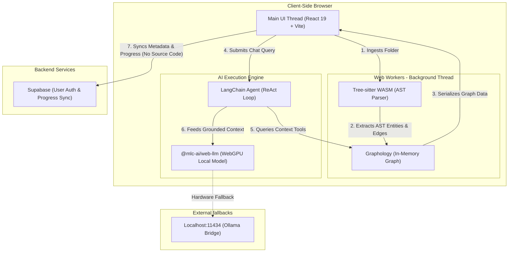

# 👁️ Mycelium

Mycelium is a **local-first codebase visualizer and AI assistant** that runs entirely within the user's web browser. By leveraging WebAssembly and WebGPU, Mycelium parses complex project repositories, builds active dependency graphs, and executes large language model (LLM) inference locally on the client's GPU—requiring zero cloud server compute costs and guaranteeing enterprise-grade source code privacy.

---

## 🚀 Key Features

*   ⚡ **In-Browser AST Ingestion (WASM):** Upload or drag-and-drop local project folders. Code parsing is handled in background **Web Workers** using **Tree-sitter WebAssembly (WASM)**, mapping out imports, classes, and functions without freezing the UI thread.
*   🤖 **WebGPU Local AI Engine:** Run quantized open-source models (like Llama-3-8B-Instruct or Phi-3-Mini) directly inside the browser using **WebGPU (`@mlc-ai/web-llm`)**. No paid APIs, no rate limits, and zero external network calls for inference.
*   ⛓️ **Nexus Agent (ReAct Loop):** Built on **LangChain.js**, the local agent queries an in-memory **Graphology** database to fetch precise codebase context before generating answers, eliminating AI hallucinations.
*   🕸️ **Interactive Graph Visualizations:** 
    *   **Sigma.js (WebGL-based):** Smoothly displays massive codebase structure and file dependency networks.
    *   **React Flow:** Generates structured visual roadmaps and onboarding curricula (e.g., "Repo 101" onboarding tracks).
*   🔒 **Zero-Trust Privacy Model:** RepoLens uses a hybrid backend strategy with **Supabase** only for user auth and learning progress metadata. **Your actual source code never leaves your browser.**
*   🔌 **Ollama Fallback Bridge:** Seamlessly switch to a local Ollama instance (`localhost:11434`) for older machines without WebGPU or to run larger models.

---

## 🏗️ System Architecture

RepoLens operates on a client-orchestrated **Hybrid Architecture**:



---

## 🛠️ Tech Stack

*   **Frontend Framework:** React 19, Vite, TypeScript
*   **AST Code Parsing:** Tree-sitter WASM (`tree-sitter-wasms`)
*   **Graph Engine:** Graphology (directed graphs), Sigma.js (WebGL renderer), React Flow (educational UI)
*   **Code Interface:** Monaco Editor (VS Code core engine for client-side editing & viewing)
*   **AI Frameworks:** `@mlc-ai/web-llm` (WebGPU inference), LangChain.js (ReAct agent)
*   **Styling:** Custom CSS3 styling system featuring glassmorphism and modern UI variables
*   **Backend Database:** Supabase (Auth, Postgres metadata sync)

---

## 📦 Getting Started

### Prerequisites

*   **Node.js** (v18+)
*   **WebGPU-compatible browser** (Chrome 113+, Edge 113+, Opera, or Safari/Firefox developer builds with WebGPU flags enabled)

### Installation

1.  **Clone the Repository:**
    ```bash
    git clone https://github.com/EgyptianMama/Mycelium.git
    cd Mycelium/frontend
    ```

2.  **Install Dependencies:**
    ```bash
    npm install
    ```

3.  **Configure Environment Variables:**
    Create a `.env` file in the `frontend` root:
    ```env
    VITE_SUPABASE_URL=your_supabase_url
    VITE_SUPABASE_ANON_KEY=your_supabase_anon_key
    ```

4.  **Run Locally:**
    ```bash
    npm run dev
    ```
    Open `http://localhost:5173` in your browser.

---

## 🛡️ Privacy & Security

RepoLens is built with user privacy as the top priority.
*   **Local Processing:** File parsing, AST generation, and relationship extraction occur locally via Web Workers.
*   **Local Inference:** Chat queries and explanation synthesis are executed on your device’s GPU.
*   **Secure Cloud Syncing:** The Supabase database stores only authentication details, custom notes, and high-level progress (e.g. lesson checkmarks). **The raw code from your ingested folder is never sent to the server.**
