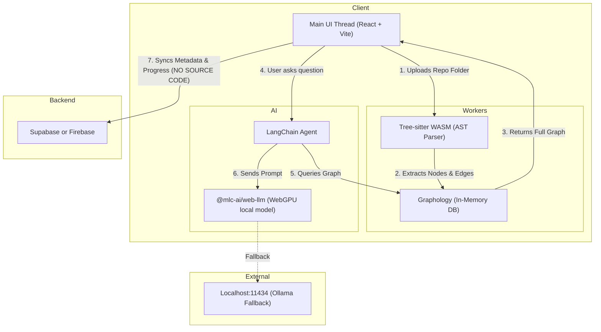

# RepoLens Hybrid Architecture

This document provides a comprehensive overview of the RepoLens system architecture. RepoLens employs a **Hybrid Architecture** designed to maximize user privacy, eliminate cloud compute costs for heavy processing, and still provide cloud-synced state management.

---

## 1. System Overview

RepoLens consists of three primary layers:
1.  **The Presentation & Orchestration Layer (Main UI Thread)**
2.  **The Ingestion & Processing Layer (Web Workers)**
3.  **The State Management Layer (Cloud Backend)**

Because the heaviest computational tasks (AST parsing, graph building, and AI inference) happen entirely within the user's browser, the application scales infinitely at zero marginal cost for compute.

---

## 2. Architecture Diagram

---

## 3. Layer Breakdown

### 3.1 Presentation & Orchestration (Main UI Thread)
*   **Technologies:** React 19, Vite, TypeScript, Vanilla CSS.
*   **Responsibilities:**
    *   Renders the interactive premium UI (glassmorphism, dark mode).
    *   Manages the file dropzone (reading local files via the File System Access API or standard HTML5 File API).
    *   Visualizes the graph using **Sigma.js** (for dense dependency networks) and **React Flow** (for step-by-step curriculum flows).
    *   Communicates with Web Workers via `postMessage` (using the `Comlink` library for RPC-style async calls).

### 3.2 Ingestion & Processing (Web Workers)
*   **Technologies:** `tree-sitter-wasms`, `graphology`.
*   **Responsibilities:**
    *   **Parsing:** Receives raw file text from the UI thread and parses it using Tree-sitter language grammars compiled to WebAssembly.
    *   **Graph Construction:** Identifies entities (Classes, Functions, Imports) and relationships (Calls, Inherits) and builds a directed graph using `graphology`.
    *   **Why Web Workers?** Parsing thousands of files is highly CPU-intensive. Running this in background workers prevents the main UI thread from freezing, ensuring animations and progress bars remain 60fps.

### 3.3 The AI Engine
*   **Technologies:** `@mlc-ai/web-llm`, LangChain.js.
*   **Responsibilities:**
    *   **In-Browser Inference:** Downloads a quantized model (e.g., Llama-3-8B) into browser storage. Uses WebGPU to generate text natively on the user's graphics card.
    *   **Agent Orchestration:** LangChain operates a ReAct loop, giving the LLM "tools" to query the `graphology` database to find answers grounded in the actual codebase.

### 3.4 State Management (Cloud Backend)
*   **Technologies:** Supabase or Firebase (PostgreSQL/NoSQL).
*   **Responsibilities:**
    *   **Authentication:** Manages user sign-ups and sessions.
    *   **Metadata Storage:** Stores a record of the repositories a user has analyzed (Name, URL, Git Commit Hash, Access Tokens if applicable).
    *   **Learning Progress:** Stores the output of the AI (e.g., "Lesson 1 Summary", saved code snippets, or user notes).
    *   **Security Boundary:** **The actual source code files are NEVER uploaded to this database.** This guarantees enterprise-grade privacy and keeps database storage costs near zero.

---

## 4. Key Data Flows

### The Ingestion Flow
1. User drops a local folder into the RepoLens UI.
2. The UI reads the files into memory (strings) and sends them to the Web Worker pool.
3. Tree-sitter parses the strings into Abstract Syntax Trees (ASTs).
4. Extractors map the ASTs into nodes and edges, inserting them into `graphology`.
5. The Web Worker serializes the final graph and sends it back to the UI thread.

### The Educational Q&A Flow
1. User selects a complex 500-line function and clicks "Explain this".
2. The UI extracts the function's code and its graph dependencies (who calls it, who it calls).
3. The UI constructs a system prompt containing the code and graph context.
4. The prompt is sent to the WebGPU model (or Ollama fallback).
5. The model streams the plain-English explanation back to the UI.
6. The user clicks "Save to Notes," and the text summary is synced to the Supabase cloud backend.
